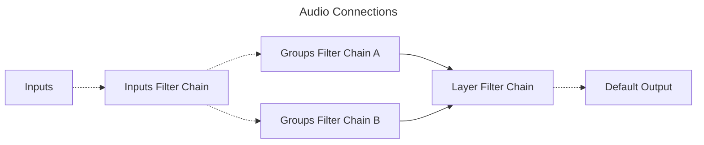
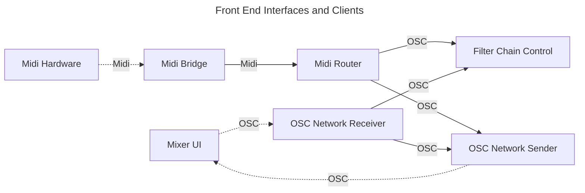
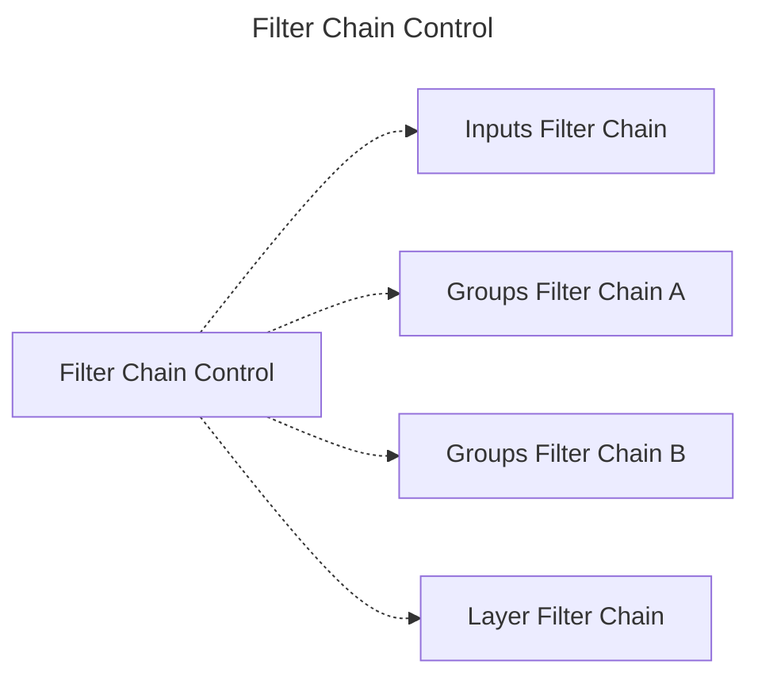
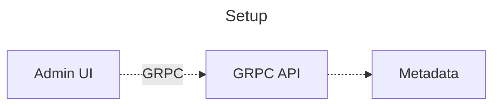
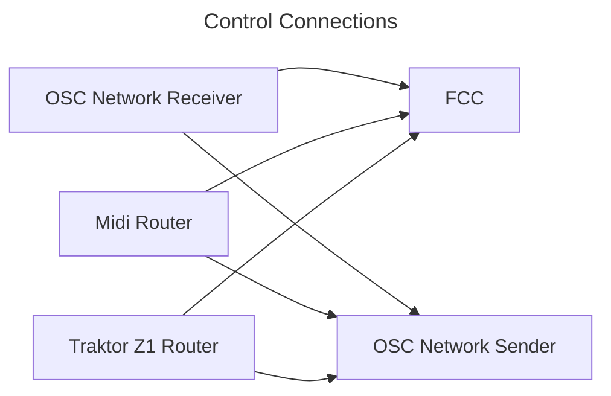
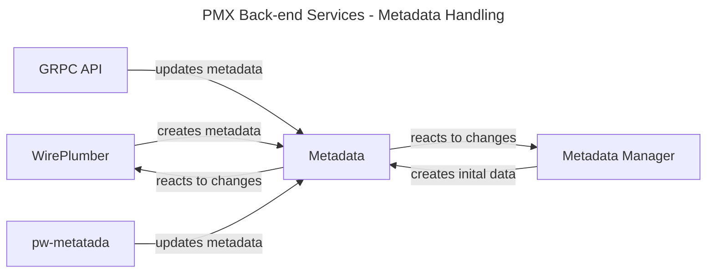

At its core, PMX-1 tries to use as much functionality as possible from the
underlying Linux desktop infrastructure, especially systemd, pipewire, and
wireplumber.

Systemd is used to manage the services and their startup, provides the logging
system, and an easy means to set up simple configuration files. Albeit that is
important functionality, it is not the focus of this section.

Pipewire provides the heart of the functionality, it is used to route the
audio and control data, provides the filter chains for the signal processing in
the mixer channels and other functionality, for example metadata for
configuration. The functionality of pipewire is extended by wireplumber, which
provides us the means to watch and react to changes in the pipewire graph. This
is used to manage connections, either based on changes in the graph, like the
addition of a new port, or changes to metadata.

The following section describes how pipewire and wireplumber are used in PMX-1.

## Audio Flow

Audio flow is pipewires domain, and except for the
[connection management](#connection-management), completely implemented using
pipewire. The filter chain module is used to build four filter chains:

- [Input Channels](/docs/input-channels) - Provides the input channels. Splits
  each input channel once to provide an input channel for each layer
- [Group Channels A](/docs/group-channels) - provides the group channels for
  layer A
- [Group Channels B](/docs/group-channels) - Provides the group channels for
  layer B
- [Layer Channels](/docs/layer-channels) - Provides the layer channels

Each filter chain is built out of several interconnected LV2 plugins and are
described in more detail in the respective sections.

The audio inputs are connected to one stereo channel of the input channels.
Each input channel is then connected to one group channel in layer A and one
group channel in layer B. The group channels are then connected to the layer
mixer. The setup is illustrated in the following diagram:

{}
Every line in the following diagram represents multiple connections between
nodes. Dotted lines are managed connections, connections that are created based
on configuration or events, for example a new port being added to the graph.

Solid lines are static connections, they are created when both nodes are
available for the first time and not touched again.

{}

Pipewire is used to create the filter chains and it transports the audio data in
between the participants. The connection are handled by wireplumber, this is described
in the section [Connection Management](#connection-management).

## Control Flow

The other big part of the system is the ability to control the mixer. This is
implemented using OSC and MIDI, with the help of custom pipewire filters. The
control flow for [mixer parameters](#mixer-parameters) is described in the next
section.

The other part is [Setup and Configuration](#setup-and-configuration) of the
mixer which is implemented using GRPC and a custom front end `Admin UI`.

### Mixer Parameters

The mixer parameters are all parameters of the LV2 and built-in plugins  used
in the filter chains. They determine the sound of the mixer and are controlled
either using the OSC API or MIDI. The control flow is illustrated in the
following diagram.

{}
Dotted lines in the forthcoming diagram represent control data that is sent
using a means outside of pipewire. For MIDI data, that typically means USB MIDI
or MIDI provided by an audoio interface, for OSC data, that means OSC over UDP.

Solid lines are pipewire links, transmitting the control data embedded in
SPA Pods.

{}

As one can see immediately, most actual pipewire links transmit OSC data, and
that is no accident, as OSC was chosen for the internal communication, due to
its much greater power in comparison to MIDI. The MIDI interface is basically
provided by the MIDI Router which takes the MIDI data from the hardware via the
ALSA MIDI bridge and converts it to OSC data.

The interface to inject OSC messages into the system is provided by the OSC
Network Receiver, which listens on an UDP port and sends every message it
receives along its output.

MIDI Router and Network Receiver both send OSC messages to the Filter Chain
Control. Filter Chain Control interprets the messages and translates them into
filter chain parameter changes which it applies to the filter chains as shown
below.

Additionally, MIDI Router and Network Receiver send the same data to the OSC
Network Sender, so that every change in the system that is generated by the
MIDI or the OSC interface is feed-back along the OSC Network Sender to the
Mixer UI, which can then update its controls.

### Setup and configuration

## Connection Management

Connection management is implemented mostly in wireplumber lua scripts, which
listen to metadata changes and changes in the graph.

### Audio Connections

The connection from the layer mixer to the output is controlled by wireplumber
with the normal means of configuration. The connections from the group channels
to the layer channels are created when the filter chains are first built.

{}
The connections have the same meaning as in the [Audio Flow](#audio-flow) section.
{}

The links between the inputs and the input channels, as well as the links
between the input channels and the group channels, are managed by wireplumber
scripts, and a custom metadata object named `performance-mixer`. The
wireplumber scripts listen for changes in the metadata and destroy and create
links based on that.

### Control Connections

Control connection management is dead simple, a wireplumber script connects all
output ports named `pmx-osc` to all input ports named `pmx-osc`. Adding a new
parameter processor is as simple as adding a new port to the graph.

## Metadata Handling

The metadata object itself is created using the per-delivered wireplumber script
`metadata.lua` in the `pmx.conf` wireplumber configuration file. This makes
sure that the metadata object is created on start up and will be available to
all services that depend on it.

To use the metadata object, all the services connect to the existing metadata
object and either listen to changes or update the metadata object themselves.
The relationship between the metadata object and the services is described in
the following diagram.

