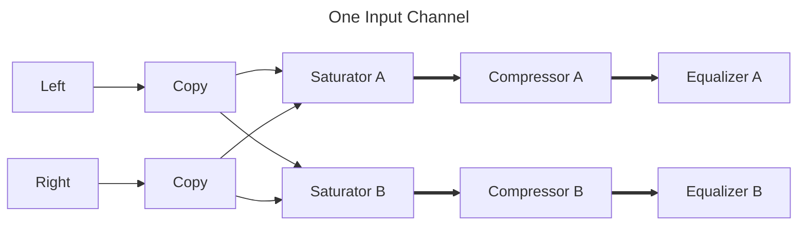

The input channels section provides 16 stereo inputs. Each of the stereo inputs
are copied, and the fed into a channel strip each. This means that for each
stereo input, the input channels section has two independent channel strips.
One of the channel strips is said to belong to layer A, the other one to layer
B. Each layer will then be routed through their own
[group mixer](/docs/group-channels). The two group mixer are then brought
together in the [layer mixer](/docs/layer-channels). That provides you, the
artist with two completely independent mixes that can be combined as desired.

The following diagram illustrates the signal flow for one input channel.

## Plugins

|Purpose|Plugin|Link|
|--|--|--|
|Saturator|Calf Saturator|[Calf Studio Gear](https://calf-studio-gear.org/)|
|Compressor|Calf Compressor|[Calf Studio Gear](https://calf-studio-gear.org/)|
|Equalizer|3-Band EQ from the Mini Series|[DISTRHO Mini Series](https://github.com/DISTRHO/Mini-Series)|
