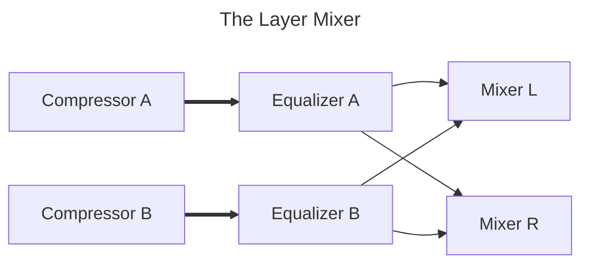

## Plugins

|Purpose|Plugin|Link|
|--|--|--|
|Compressor|Calf Compressor|[Calf Studio Gear](https://calf-studio-gear.org/)|
|Equalizer|3-Band EQ from the Mini Series|[DISTRHO Mini Series](https://github.com/DISTRHO/Mini-Series)|
