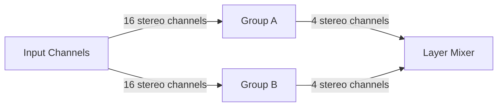

At its core, PMX-1 is a digital stereo performance mixer with three stages. The
first stage, the input stage, provides 16 stereo inputs. The stereo inputs are
duplicated, each input is routed into two stereo channels with its own
saturator, equalizer and compressor. These 32 channels are then feed into the
second stage, the group stage. The [Input Channels](/docs/input-channels)
section describes the input stage in more detail.

The group stage consists of two group mixers, each of them grouping 16 channels
from the input stage, so that each group mixer receives every signal present at
the inputs. Those are routed into 4 group channels, each with a compressor and
an equalizer. In practice, this means that means that PMX-1 creates two
completely mixes, called layers, which are feed into the third stage, the layer
stage. The [Group Channels](/docs/group-channels) section describes the group
channels in more detail.

The layer stage provides 2 stereo channels, each the input for 4 group channels,
of for each group mixer in the group stage. The layer stage combines those to
one stereo channel, the output of PMX-1. The
[Layer Channels](/docs/layer-channels) section describes the layer channels in
more detail.

## What's next?

Excited? Want to get started? Then go to the
[Getting Started](/docs/getting-started/) section and rock on!. If you want to
look under the hood and maybe get your fingers dirty with some hacking, go to
the [Architecture](/docs/architecture/) section or have a look at
[Hacking](/docs/hacking/).
